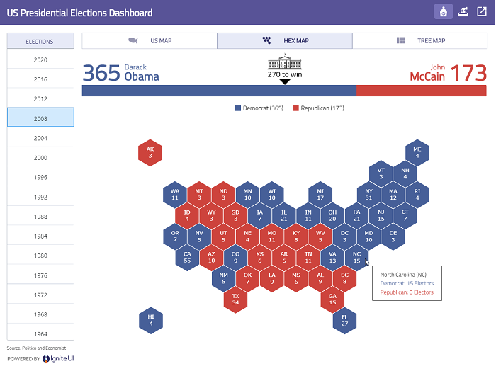

## Introduction

This repository provides source for Blazor (Client/WASM) application shows results of recent US Presidential Elections using [IgniteUI for Blazor](https://www.infragistics.com/products/ignite-ui-blazor) components.


<html lang="en" xmlns="http://www.w3.org/1999/xhtml">
    <body>
        <a target="_blank" href="https://infragistics.com/blazor-apps/usa-elections" rel="noopener noreferrer">
            
        </a>
    </body>
</html>

## Preview

<html lang="en" xmlns="http://www.w3.org/1999/xhtml">
    <body>
        
        
        
    </body>
</html>


## Setup

- instal **.NET SDK** from this website:
https://dotnet.microsoft.com/learn/aspnet/blazor-tutorial/install

## Running App in Visual Studio 2019

NOTE: VS 2019 has better code highlighting and error detection than VS Code does.

- open Visual Studio 2019 as an Administrator

- open the **BlazorClientApp.sln** solution

- right click solution and select Restore NuGet Packages

- click Debug menu and select Start Debugging or press F5 key

## Running App in VS Code

- open VS Code as an Administrator

- open this folder in VS Code

- open a terminal window
- to restore assemblies, run this command:
```dotnet restore```

- to run samples, run this command:
```dotnet watch run```

- wait for for message:
**Now listening on: http://localhost:4200**

- open **http://localhost:4200** in your browser


## Resources

- [Razor Component Models](https://www.codemag.com/article/1911052)
- [Razor Syntax](https://docs.microsoft.com/en-us/aspnet/core/blazor/components/?view=aspnetcore-3.1#razor-syntax)
- [Getting reference to components](https://docs.microsoft.com/en-us/aspnet/core/blazor/components/?view=aspnetcore-3.1#capture-references-to-components)
